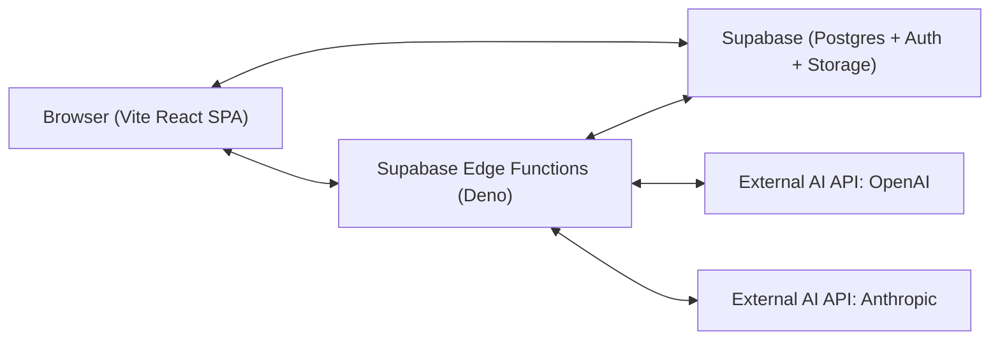

# SpecForge Architecture

## 1. System Overview

SpecForge is a planning and memory workspace for AI-assisted software builders. It helps a single authenticated user move from raw ideas into durable project memory: PRDs, architecture docs, context files, feature chunks, feature specs, coding-agent prompts, build progress, issue prompts, knowledge insights, and exportable markdown packs.



The SPA talks directly to Supabase for read-mostly operations where Row Level Security can enforce access safely. The SPA only goes through Edge Functions when a secret-bearing operation is required, such as AI generation, protected system writes, logging, cleanup, or other backend-only workflows.

## 2. Tech Stack

- Frontend: Vite, React 18+, TypeScript (strict), Tailwind CSS, shadcn/ui, React Router for client-side routing, Zod for validation, and the Supabase JS client. No Next.js. No SSR.
- Backend: Supabase Postgres, Supabase Auth, Supabase Storage, and Supabase Edge Functions on the Deno runtime. No separate Node backend. No Express, no Fastify, no custom server.
- Database: Supabase Postgres. Authorization enforced via Row Level Security (RLS).
- Auth: Supabase Auth. Methods enabled: email/password and Google OAuth. No Clerk.
- AI: OpenAI SDK and Anthropic SDK, both invoked only from Edge Functions.
- Validation: Zod. Shared schemas live in `backend/_shared/schemas/` and are imported by `frontend/` via relative path.
- Styling: Tailwind CSS + shadcn/ui.
- Logger: Tiny custom wrapper, mirrored in `frontend/src/lib/logger.ts` and `backend/_shared/logger.ts`. `console.log` is forbidden in committed code; ESLint enforces this.
- Tooling: pnpm for frontend package management, ESLint, Prettier, and TypeScript strict mode.
- Deploy: Vercel or Netlify for the SPA, and Supabase CLI for Edge Functions and migrations. SPA → Vercel or Netlify. Edge Functions → Supabase. Two separate deploys.

## 3. Repository Structure

```text
specforge/
├── .gitignore
├── README.md
├── AGENTS.md
├── CLAUDE.md
├── context/
│   ├── 01-project-overview.md
│   ├── 02-architecture.md
│   ├── 03-code-standards.md
│   ├── 04-ai-workflow-rules.md
│   ├── 05-ui-context.md
│   ├── 06-progress-tracker.md
│   └── decisions.md
├── feature-specs/
│   └── (existing specs)
├── frontend/
│   └── README.md
└── backend/
    └── README.md
```

Repository structure: Single repo, two top-level folders: `frontend/` and `backend/`. The folders are separate because the frontend and backend have different runtimes, build commands, deployment targets, and dependency constraints. `frontend/` is a browser SPA built with Vite and React. `backend/` is Supabase Edge Functions, shared Deno code, and database migrations.

The code review recommended two separate repos for frontend and backend. SpecForge deliberately deviates from code review item #5 and uses a single repo with two folders instead, for solo-dev velocity. A single repo keeps chunk specs, context, schema changes, frontend changes, and backend changes in one review surface while the product is still moving quickly.

`backend/_shared/` is importable from `frontend/` via relative path for shared Zod schemas only. No other cross-folder imports are allowed. Frontend code must not import backend runtime utilities, AI clients, auth helpers, logger implementations, response helpers, or any secret-bearing code.

## 4. Frontend Architecture

The frontend is a Vite + React + TypeScript SPA with a single entry at `frontend/src/main.tsx`. It uses React Router for client-side routing. All routes under `/dashboard`, `/projects/*`, and `/settings` are protected by an auth guard.

State rules are strict:

- React Query (TanStack Query) is used for server state.
- React Context is used for auth.
- Component-local state is used for everything else.
- No Redux, no Zustand, unless explicitly approved later.

The folder layout inside `frontend/src/` is:

```text
src/
  components/        (shadcn/ui primitives + composed components)
  features/          (one folder per feature: dashboard, prd, architecture, chunks, etc.)
  lib/               (logger, supabase client, utilities)
  config/            (env.ts - typed env access)
  constants/         (errors.ts, routes.ts, etc.)
  hooks/             (shared hooks)
  types/             (frontend-specific types only)
  pages/             (route-level components)
  main.tsx
  App.tsx
```

The frontend hides UI that a user cannot access, but it never treats hidden UI as authorization. Supabase RLS and Edge Function auth checks are the actual enforcement layer.

## 5. Backend Architecture

Supabase Edge Functions live under `backend/functions/<function-name>/index.ts`. Shared code lives under `backend/_shared/`, including logger, AI abstraction, error constants, response envelope, Zod schemas, and auth helpers. Database migrations live under `backend/supabase/migrations/`. RLS policies live alongside migrations, with one migration per logical change.

Every Edge Function:

- Validates input with Zod.
- Authenticates via the Supabase JWT in the `Authorization` header.
- Returns the standard response envelope: `{ ok: true, data } | { ok: false, error: { code, message } }`.
- Uses correct HTTP status codes: `200`, `201`, `400`, `401`, `403`, `404`, `422`, `429`, and `500`.
- Logs only via the shared logger, never `console.log`.

The backend is Supabase Edge Functions on the Deno runtime. No separate Node backend. No Express, no Fastify, no custom server.

## 6. Database Model (High-Level)

Full schema details and RLS policies are defined in Chunk 04. The tables that will exist are:

- `users` - mirror of `auth.users` for app-level fields.
- `projects`
- `project_documents`
- `feature_chunks`
- `feature_specs`
- `project_issues`
- `project_learnings`
- `generation_logs`

Every table except `auth.users` has RLS enabled and policies scoping rows to `auth.uid()`. Full schema and policies are defined in Chunk 04.

## 7. Authentication Model

Provider: Supabase Auth.

Methods enabled:

- Email/password.
- Google OAuth.

Sessions are managed by the Supabase JS client, which stores sessions in `localStorage` by default.

The frontend has an `AuthProvider` context exposing `user`, `session`, `loading`, `signIn`, `signUp`, `signInWithGoogle`, and `signOut`. Protected routes use a `<RequireAuth>` wrapper that redirects to `/sign-in` when no session exists.

Every Edge Function reads the JWT from the `Authorization: Bearer <token>` header, verifies it via Supabase, and uses the resulting `user.id` for all DB queries.

## 8. Authorization Model

All authorization is enforced server-side via Postgres RLS. The frontend never trusts itself for authorization; it only hides UI, and the database denies unauthorized queries.

Edge Functions do not bypass RLS. They use the user's JWT, not the service role key, for any user-data query. The service role key is never used for user-data queries. Service role key is reserved for system-level operations such as logging and cleanup.

## 9. AI Provider Abstraction

Location: `backend/_shared/ai/`.

Public interface:

```ts
generate(type: GenerationType, input: unknown): Promise<GenerationResult>
```

Implementation: a config map `{ [type]: { provider: 'openai' | 'anthropic', model: string, systemPrompt: string } }` lives in `backend/_shared/ai/config.ts`. The `generate` function reads the config, dispatches to the right provider client, validates output with Zod, and returns a typed result.

Both API keys, `OPENAI_API_KEY` and `ANTHROPIC_API_KEY`, are stored as Supabase Edge Function secrets, never committed.

Default provider mapping, to be reviewed in Chunk 02:

- Short structured generations, including clarifying questions, prompt generation, and error-to-spec → OpenAI.
- Long-form documents, including PRD, architecture, feature specs, and context files → Anthropic.
- Knowledge extraction → Anthropic.

The mapping is configurable. Changing a generation type's provider requires editing one line in `config.ts`, with no feature code changes.

## 10. Validation Strategy

Library: Zod.

Shared schemas live in `backend/_shared/schemas/`. Frontend imports them via relative path:

```ts
import { ProjectCreateSchema } from '../../../backend/_shared/schemas/project'
```

Every Edge Function input is validated with Zod at the boundary. Invalid input returns `422` with the standard error envelope.

Every form on the frontend uses the same Zod schema for client-side validation, ensuring zero drift.

## 11. Logging Strategy

Library: tiny custom wrapper, about 20 lines per side.

Frontend logger: `frontend/src/lib/logger.ts`. In production builds, when `import.meta.env.PROD === true`, `debug` and `info` are no-ops. `warn` and `error` still fire to `console.warn` and `console.error`.

Backend logger: `backend/_shared/logger.ts`. It reads `Deno.env.get('ENVIRONMENT')`; in `production`, `debug` and `info` are no-ops.

ESLint enforces `no-console: error` everywhere except inside the logger files themselves. `console.log` is forbidden in committed code.

Sensitive data, including tokens, passwords, full user objects, and API responses with secrets, must never be passed to the logger. This rule is enforced by code review, not by the tool.

## 12. Error Handling Strategy

All error messages used in API responses live in `backend/_shared/constants/errors.ts` as a typed enum. Frontend mirrors user-facing copy in `frontend/src/constants/errors.ts`.

Every Edge Function wraps its handler in a top-level try/catch that returns the standard envelope with the right HTTP status. Frontend uses React Query's error state plus a global error boundary for unhandled errors.

## 13. Response Envelope

Every Edge Function returns:

```ts
type ApiResponse<T> =
  | { ok: true; data: T }
  | { ok: false; error: { code: string; message: string } };
```

HTTP status codes follow REST conventions:

- `200` - success on read or update.
- `201` - success on create.
- `400` - malformed request.
- `401` - missing or invalid auth.
- `403` - authenticated but unauthorized.
- `404` - resource not found.
- `422` - validation failed.
- `429` - rate limited.
- `500` - unhandled server error.

## 14. Deployment

SPA deployment is Vercel or Netlify, to be decided in Chunk 31. Build command: `pnpm run build` in `frontend/`. Output: `frontend/dist/`.

Edge Functions are deployed via:

```bash
supabase functions deploy <name>
```

from `backend/`.

Migrations are applied via:

```bash
supabase db push
```

from `backend/`.

Two CI workflows are planned in Chunk 31: one for SPA and one for backend.

## 15. Architectural Risks

- Single-repo two-folder layout is a deliberate deviation from the code review. If team size grows past one or two engineers, splitting into two repos becomes worth reconsidering.
- Cross-folder relative imports, where `frontend/` imports from `backend/_shared/schemas/`, are tolerated for Zod schemas only. If this ever expands to runtime code, refactor immediately.
- Supabase Edge Functions are Deno; npm registry packages are not all compatible. Verify package compatibility before adding a backend dependency.
- Provider switching at the AI layer assumes both providers can handle the same prompt shape. If a provider returns malformed JSON, the generation fails. Zod-validating every output is the safety net.
